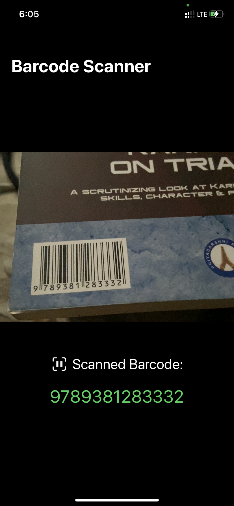

# BarcodeScanner

A simple app that demonstrates the use of Coordinator in SwiftUI.
The learnings from this app are:
- How to make `UIViewControllerRepresentable`
- How to connect it to a SwiftUI view using `Coordinator`

